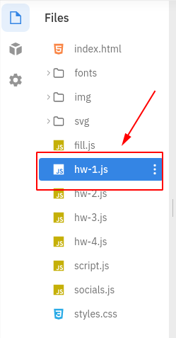
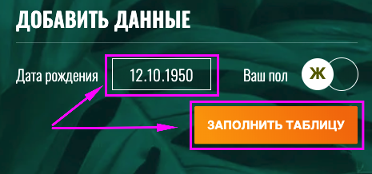

# Домашнее задание к лекции «Новое знакомство с компьютером»

По ходу нашего курса мы будем дорабатывать мотивационное веб-приложение, в котором пользователь может рассчитать сколько недель он прожил со дня его рождения до сегодняшнего дня. 

Вы можете открыть проект по [ссылке](https://repl.it/@netologySD/SD-diploma) и изучить его. 

В данный момент приложение работает некорректно. Нам с вами предстоит внести в него правки так, чтобы оно заработало правильно. В конце курса у вас получится полностью рабочее приложение, которым вы сможете поделиться со своими друзьями или опубликовать ссылку на него в социальных сетях. 

## Описание задания
На первой лекции вы узнали о существовании переменных и о правилах именования. А так же вы научились сохранять числа в переменные и производить с ними математические вычисления. 

Давайте отработаем полученные навыки. 

В данный момент неправильно рассчитывается количество прожитых недель. Это происходит по причине того, что текущая дата и дата рождения пользователя хранятся в миллисекундах. Для правильного расчёта нам нужно поделить миллисекунды на несколько значений. Именно над этим мы и будем работать. 

### Перед работой
1. Зарегистрируйтесь на сайте [repl.it](https://repl.it/). Регистрация нужна для того, чтобы не потерять доступ к вашему проекту.
2. Откройте проект по [ссылке](https://repl.it/@netologySD/SD-diploma).
3. Нажмите кнопку `Fork`:


Так вы создадите вашу копию проекта, над которой будете работать в этом и последующих домашних заданиях.

4. В списке файлов слева найдите файл с именем `hw-1.js` и кликните на него:



5. В открывшемся файле внимательно прочитайте комментарии к коду — серые строки после символов `//`:


## Задача №1
1. Придумайте имя для переменной, в которой будет храниться число, обозначающее количество минут в часе. Помните про правила именования переменных.
2. Создайте переменную при помощи ключевого слова `let` и придуманного вами имени. 
3. Присвойте в эту переменную значение `60`.

## Задача №2
1. Придумайте имя для переменной, в которой будет храниться число, обозначающее количество часов в сутках. 
2. Создайте переменную при помощи ключевого слова `let` и придуманного вами имени. 
3. Присвойте в эту переменную значение `24`.

## Задача №3
1. Найдите в коде строку: 
```javascript
let livedWeeks = Math.floor((today - birthDate) / 1000 / 60 / 0 / 0 / 7); 
```
Видите, в этой строке есть два нуля? Их нужно заменить на переменные, которые мы создали в задачах №1 и №2.

2. Удалите первый ноль (0), идущий после `60 / `, и вместо него напишите имя переменной, хранящей значение количества минут в часе (из задачи №1).

3. Удалите сделующий ноль (0), идущий перед ` / 7`, и вместо него напишите имя переменной, хранящей значение количества часов в сутках (из задачи №2). 

---

Теперь вычисления должны быть правильными. Проверим это!
1. Нажмите на кнопку `Run`: 


2. В правой части окна появится наше веб-приложение. 
3. В поле ввода даты рождения введите дату `12.10.1950` и нажмите кнопку `Заполнить таблицу`:



4. Если все задания выполнены верно, то таблица будет выглядеть так:


**Обратите внимание**: количество точек в вашей таблице будет отличаться в большую сторону поскольку с момента создания скриншота прошло уже несколько недель.  

Странная конструкция с `undefined` справа от таблицы — это нормально. Мы исправим этот момент в следующем домашнем задании.
